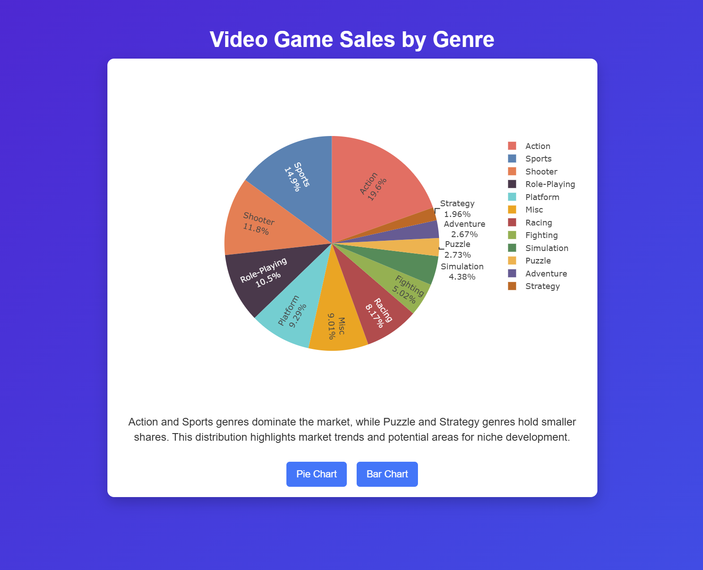

# Game Sales Dashboard

Interactive video game sales dashboard built with HTML, CSS, and JavaScript (Plotly.js).

---

## 🎮 Interactive Video Game Sales Dashboard
An interactive dashboard visualizing global video game sales by genre.  
Built with HTML, CSS, JavaScript, and Plotly.js — fully responsive and mobile-friendly.

<p align="center">
  
</p>

---

## 🔗 Live Demo
View the live project here: [GitHub Pages Demo](https://askinsart.github.io/game-sales-dashboard/)

---

## 📊 Features
- **Interactive Pie & Bar Charts** – switch between chart types with one click.  
- **Real Dataset** – based on publicly available game sales data.  
- **Smooth Visual Effects** – fade-in animations and gradient background.  
- **Responsive Design** – looks great on desktop, tablet, and mobile.  
- **Hover Tooltips** – explore detailed data values by hovering.

---

## 🛠️ Tech Stack
- HTML5  
- CSS3 (Responsive Flexbox Layout)  
- JavaScript (Vanilla JS + Plotly.js)  

---

## 🚀 How to Run Locally
Clone the repository:  
```bash
git clone https://github.com/AskinsArt/game-sales-dashboard.git
```

## 📧 Contact
Created by **Dominic Hawes** — feel free to connect on [LinkedIn](https://www.linkedin.com/in/dominic-hawes/).
